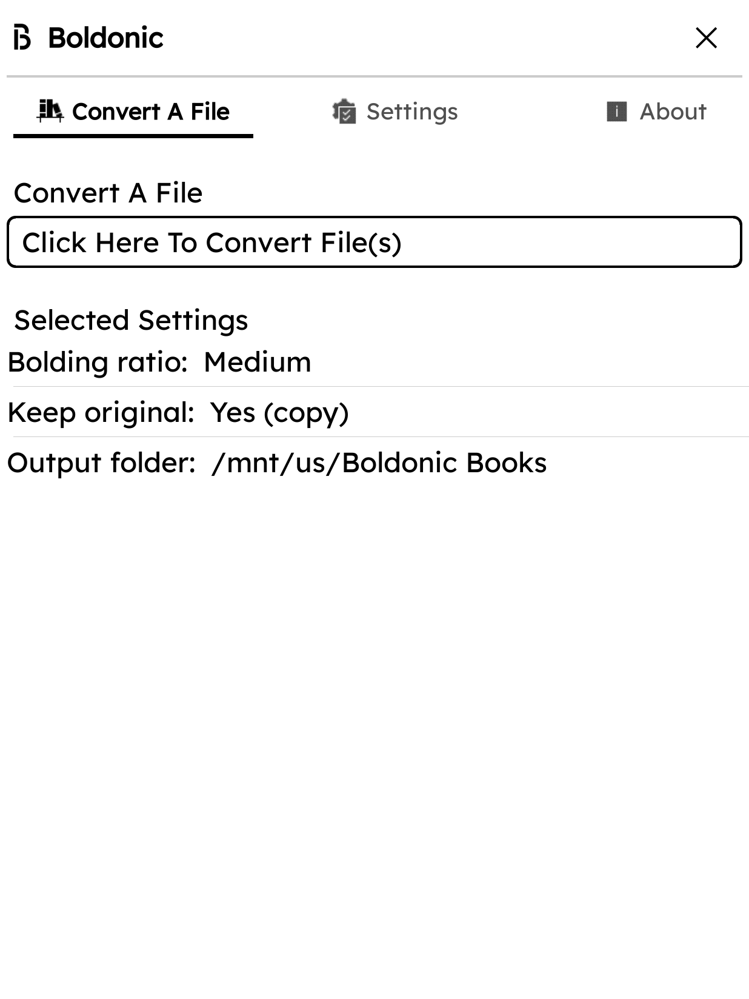
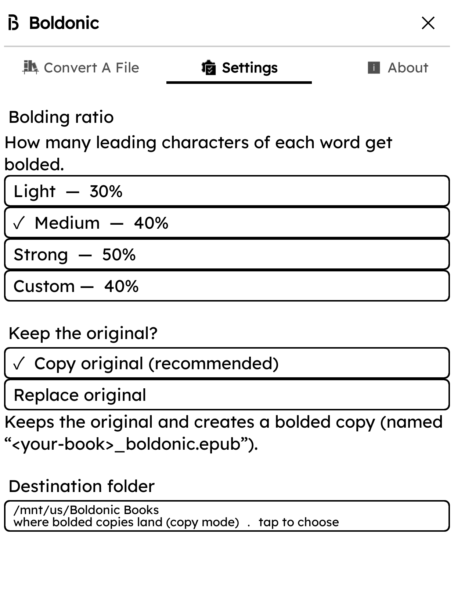
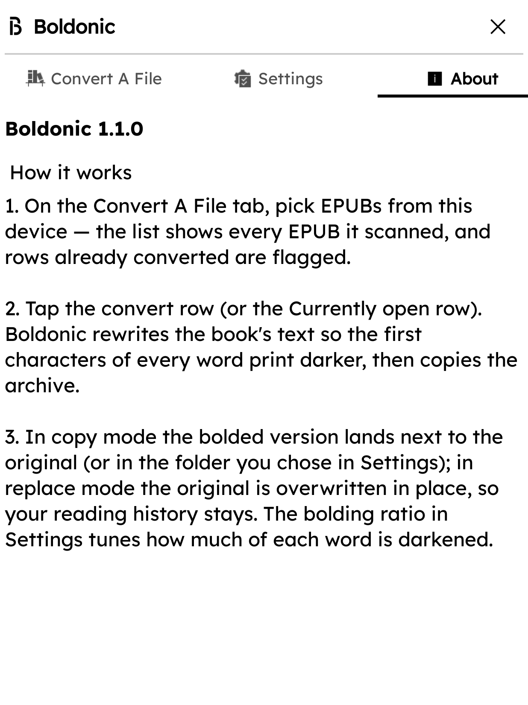

<p align="center">
  
</p>

# Boldonic

Re-render EPUB ebooks with a larger share of each word in **bold** — an assistive reading comfort feature. Converts a copy (keeps the original) or replaces the file; destination folder is your choice, any depth.

## What it does

- A full-screen Boldonic dashboard (**Convert A File** / **Settings** / **About**) inside KOReader's Tools menu.
- **Convert A File** — scans your device, lists EPUBs, search and multi-pick, or convert the currently open book.
- **Settings** — Ratio presets (Light/Medium/Strong/Custom), copy/replace mode, destination folder (any depth, create folders).
- **About** — Version info and how it works.
- Persistent conversion log, duplicate protection, offline/private.

## Screenshots

| **Convert A File** — pick files, search, multi-select, convert current book | **Settings** — ratio (Light/Medium/Strong/Custom), copy/replace, destination folder | **About** — version, how it works |
|:---:|:---:|:---:|
|  |  |  |

## Setup

1. Copy `boldonic.koplugin/` into KOReader's `plugins/` folder and restart KOReader — or install from **Storefront** (search "Boldonic").
2. Open **Tools → Boldonic** to open the dashboard.
3. Use **Convert A File** to pick EPUBs and choose a destination folder.
4. Adjust **Settings** for bolding ratio, copy/replace mode, and output folder.

## Build & test

```sh
./scripts/build-zip.sh             # → releases/Boldonic-Plugin.zip
luajit koreader-plugin/test/harness_boldonic.lua
```
